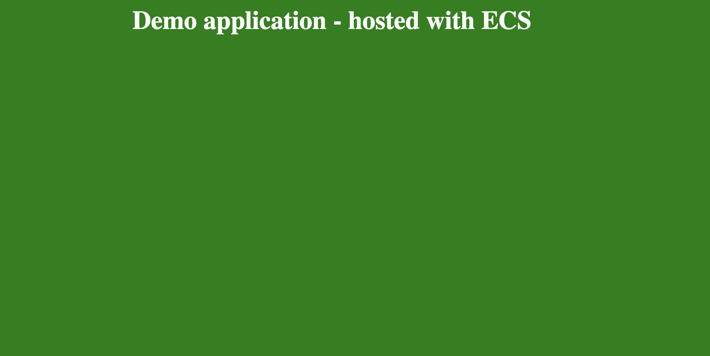

# ECS blue/ green deployment 

We will deploy a demo application on ECS Fargate and update the application using Blue/Green deployment capability of CodeDeploy and ECS. Please refer the [ECS workshop](https://ecsworkshop.com/blue_green_deployments/) for more guidance.
 
## Build and deploy the stack

* Install dependencies - `npm install`
* Build the project - `npm run build`
* Bootstrap CDK - `cdk bootstrap`
* Synthesize the output - `cdk synth`
* Review the proposed build - `cdk diff`
* Deploy the CDK stack - `cdk deploy --require-approval never`

## Testing the Blue/Green Deployment

* Access the deployed version of the application using the output value of `BlueGreenUsingEcsStack.ecsBlueGreenLBDns`
* This is the **Blue Deployment** live on Port **80**. The demo application will have a blue background
* Push code to the code-commit repository
    * Open a new terminal session and export the temporary credentials for your AWS account
    * We will push the demo application code to a CodeCommit repository created by the above stack
    * Clone the reference GitHub repository
        ```
            git clone https://github.com/smuralee/nginx-example.git
        ```
    * Change the remote origin to the CodeCommit repository. We fetch the `demo-app` repository URL
        ```
            cd nginx-example
            git remote set-url origin $(aws codecommit get-repository --repository-name demo-app | jq -r '.repositoryMetadata.cloneUrlHttp')
        ```
    * Verify the remote origin url is pointing to the CodeCommit repository
        ```
            git remote -v
        ```
    * Edit the `index.html`. We change the `background-color` to `green`
        ```html
            <head>
              <title>Demo Application</title>
            </head>
            <body style="background-color: green;">
              <h1 style="color: white; text-align: center;">
                Demo application - hosted with ECS
              </h1>
            </body>
    
        ```
    * Push the code to the CodeCommit repository
        ```
          git add .
          git commit -m "Changed the background to green"
          git push
        ``` 
* This will trigger the Blue/Green deployment for the ECS application
* The **Blue Deployment** is live on Port **80**
  
* You can test the **Green Deployment** on port **8080**
  
* Once the deployment is complete demo application with green background is visible

## Cleanup

* Delete the stack - `cdk destroy -f`
* You will need to manually delete the S3 bucket and ECR repository since they are not empty
